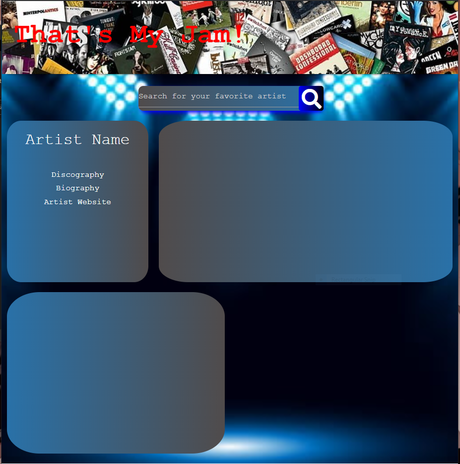
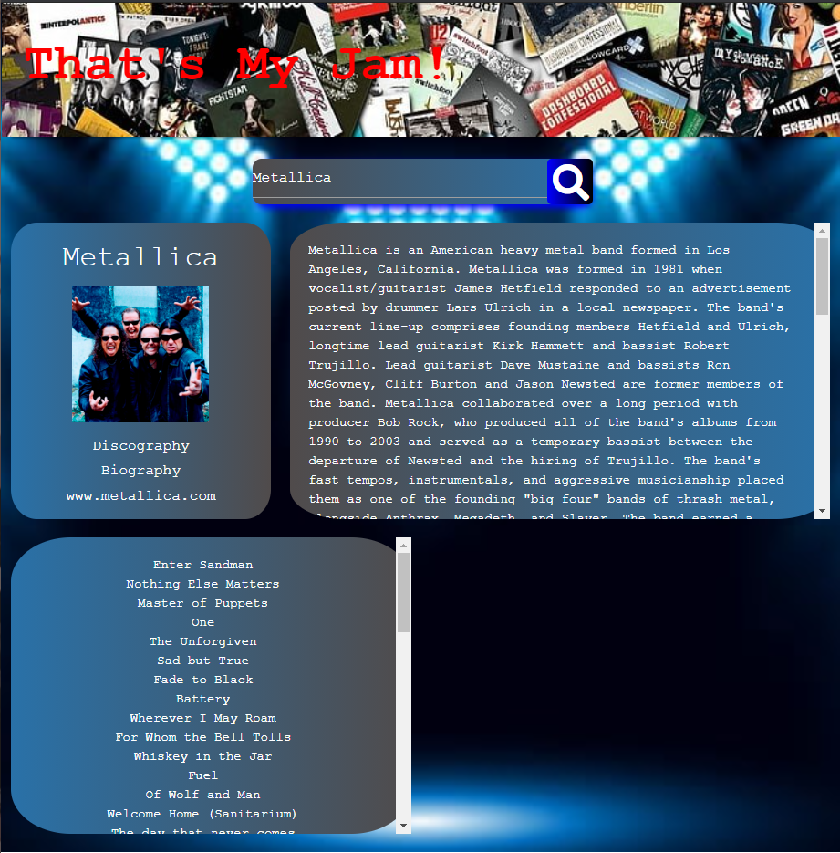
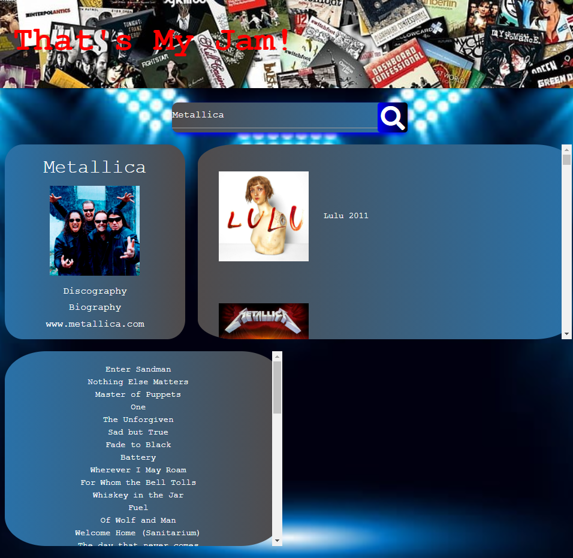
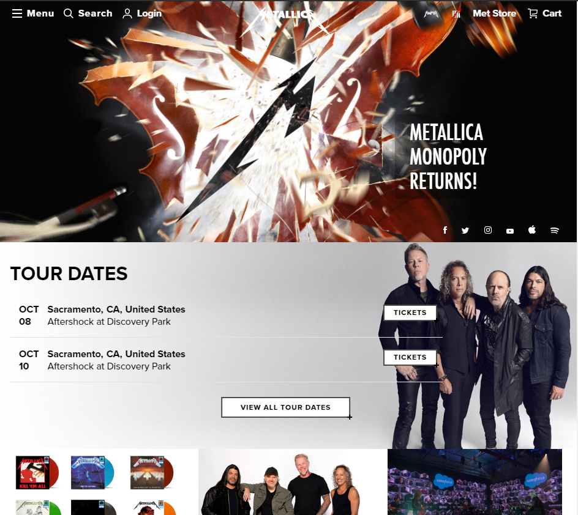
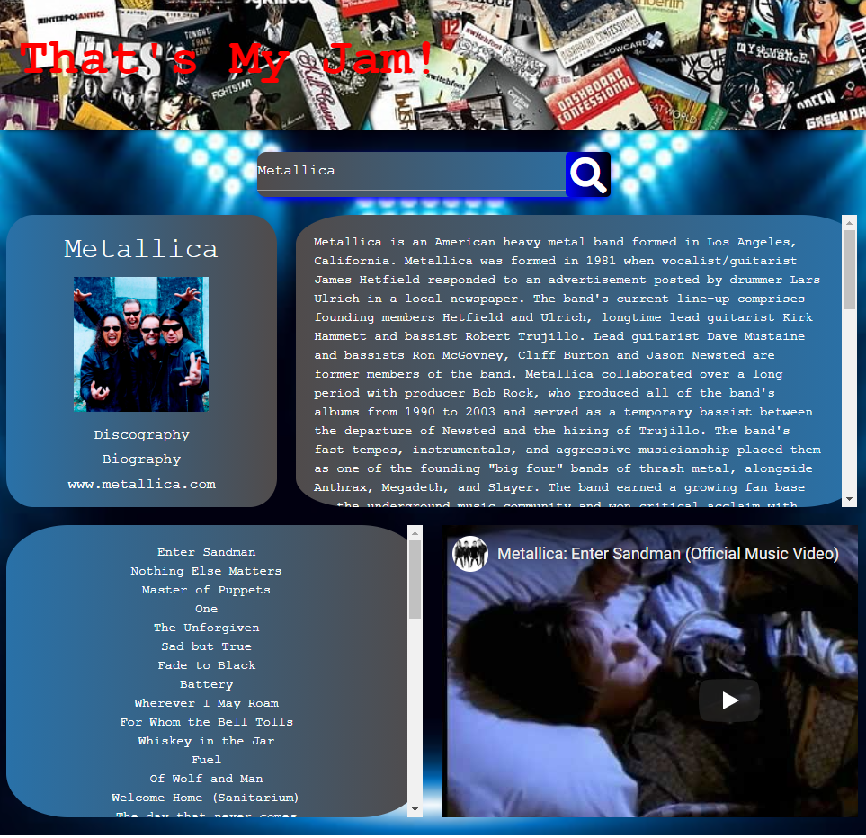

## Music Artist Page - "That's My Jam"
    
**This site is an artist and music website. It has the capability to fetch the artist's or group's history, discography, top songs, and the the ability to view the music videos for those top songs via Youtube.  This site is a fully interactive web application supported by JQuery and Materialize. The API data fetched is provided by AudioDB, last FM and YouTube. The user is also provided with local browser storage that saves the most recent searches they have made.**

    Link to page:  https://anthonyrspyker.github.io/Music/
    
    
___

## How it Works

*The images below offer the step by step process of how this website functions*.

**The above image shows the homepage of this application**.

**The user simply has to input an artist's name into the search bar and click the magnifying glass search button**.

**Once the user clicks search, the artist's biography, discography, and top songs will automatically populate and the embedded Youtube player will load**.

**When the Discography button is clicked, the artist's full discography-- with album images and release dates-- will appear to the right**.

**When the link to the artist's website is clicked, that webiste will load on the same page**. 

**Finally, when a user clicks on a song they want to view, the YouTube video for that song will appear to the right**. 

**It can play on the website or link outside the website to Youtube**.

## Moving Forward

**In the future we would like to see that the web application has the ability to play the youtube videos directly on the site apposed to being forced to link to Youtube.**
**Furthermore, we would like to see that application has a karaoke option which would search the song on Youtube, but specifically seak out videos that have the lyrics on the screen as the music plays.**
**Along with that, we would like to see that there be an option to just populate the lyrics to individual songs on the screen.**  
**Withstanding the issue of monetary incurment, there is nothing blocking these goals to be implemented in the next iteration.**

___

## Repository Contents

* README.md
* Index.html 
* Assests Folder containing CSS, JS, and image files.
* Images Folder containing images used in the README file.

___

## Site Functionality

* Responsive web design
* Stores local browser data of user

___

## Tools Used

* The AudioDB API
* LastFM API
* YouTube Data API
* YouTube Player API
* JQuery
* Materialize
* Font Awesome

